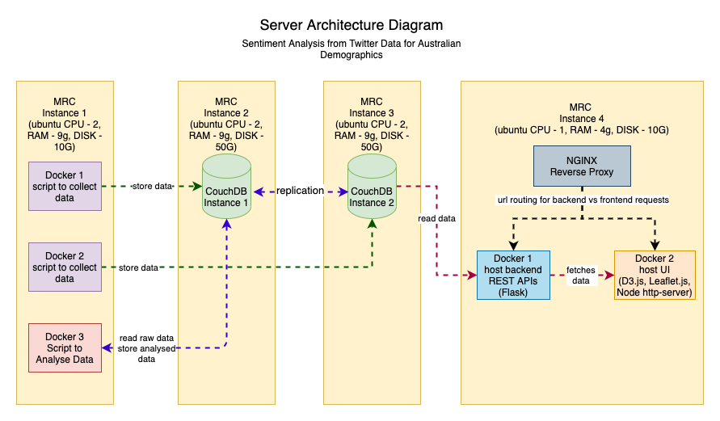

# COMP90024_Assignment2
Author(s): Ankita Dhar, Ezequiel Gallo, Hilary McMeckan, Soham Mandal, Trina Dey   
Date: 21 Apr 2021

## Problem Statement 
1. Harvest tweets from Twitter across Australian cities on UniMelb Research Cloud, along with AURIN data and analyse various
social media analytics scenarios that tell interesting stories of life in Australian cities.  
2. Augment that data with AURIN for the demographics of the city to improve knowledge.  

#### Server Architecture Requirements
1. Develop Cloud based Solutions to exploit multitude of VMs across MRC.  
2. Develop a solution that can run on any node on MRC and can scale up and down.  
3. 4 servers with 8 Cores each with 500 GB Volume Storage.  
4. Run Twitter tweet harvester application on multiple servers.  
5. CouchDB can be run on single instance or clustered mode.  

#### Core Logical Requirements
1. There should be a Twitter Harvesting Application for any/all cities of Australia.  
2. The system should be designed to avoid duplicate tweets.  
3. We can use Internet to gather information on weather, sport events, TV shows, visiting celebrities, stock market 
rise/falls, official statistics on Covid-19 however these are not compulsory to complete the work.  
4. Use the MapReduce that CouchDB offers and can compare with AURIN data.  
5. A front-end web application is required for visualising these data sets/scenarios.  
6. Languages to use Java/Python, javascript technologies etc.  

#### Implementation Requirements
1. Version Control - Github Repo  
2. MapReduce - CouchDB  
3. Scripting to deploy on servers - ANSIBLE  
4. Container Technologies - Docker  
5. UI + REST APIs 

## Error Handling
1. Issues and challenges in using the UniMelb Research Cloud should be documented.  
2. Describe the limitations of mining twitter content and language processing.  
3. Outline any particular solutions developed to tackle any scenario. 
4. Demonstrate how you tackled working within the quota imposed by the Twitter APIs through the use of the Cloud.

## Final Delivery 
1. Team Report of approximately 20-25 pages in research paper style.  
2. Report should include application developed, design and architecture, user guide to test the system, pros and cons faced during MRC usage.  
3. Role of each member in development and delivery, challenges faced and resolution.  
4. Functionality of the system and why to choose particular functionality.  
5. Confidential report to be submitted to Professor based on their role in the project and their team members roles.  
6. A demo video uploaded on YouTube.  
7. Link to Github repo  
8. Presentation Slides in case selected for live Demo. ( 15 minutes only for slides + demo)    

It is important to put your collective team details (team, city, names, surnames, student ids) in:  
- the head page of the report;  
- as a header in each of the files of the software project.  

## Tasks 
1. Fetch Data from Twitter from multiple Twitter account.  
2. Parse and clean the data and store in couchDB.  
3. Fetch related data from AURIN, store in CouchDB.  
4. Use Ansible + Docker to run the harvester application on multiple instances for faster harvesting.  
5. CouchDB Setup replicated and partitioned mode on MRC. 
6. Use CouchDB's mapReduce to parse and analyse data and store it back in CouchDB.
7. Use RESTFul API to fetch data from CouchDB and send to UI.
8. UI to display the data in some kind of maps and graphs/plots.
9. Ansible script to deploy separate docker containers for REST and UI. Nginx on MRC for url rerouting.

## Task Distribution
Each Person is given two tasks - one to write code, second to work on some server deployment.
| Tasks                       |   Owner             |
| --------------------------- |:-------------------:|
| UI                          | Ezequiel & Soham    |
| Fetching Twitter Data       | Trina               |
| NLP Analysis                | Ankita & Hilary     |
| REST API  + Deployment      | Ankita & Hilary     |
| Ansible + MRC               | Soham               |
| CouchDB Setup               | Ezequiel            |
| Docker                      | Trina & Ankita      |

## Server Architecture
Below is a server architecutre diagram. The description for each decision is given below - 

There are 4 Instances/Servers provided to us with 8GB RAM on each with 500 GB of total storage. 

1. Instance 1 on MRC will run Twitter Harvester. We are harvesting data from 10 accounts each with a limit of 500,000 
tweets a month. Thus harvesting the data in parallel on multiple docker system will be easier and faster.  
2. Once the tweets are harvested the docker container will no longer be required. So we will free up this instance and 
run the analyser on this instance.  
3. We will run CouchDB on two instances with partitioned and replicated. In case one of the instance fails, the other 
should keep the data.  
4. Lastly, on the last server we will run two docker instances of REST API and UI with Nginx on top of it to reroute 
the requests correctly and act as a web server.  

## Resources 
1. Docker - https://www.simplilearn.com/tutorials/docker-tutorial?source=sl_frs_nav_playlist_video_clicked
2. CouchDB -  
    - https://couchdb-python.readthedocs.io/en/latest/client.html#database  
    - https://docs.couchdb.org/en/stable/  
3. Front End - https://leafletjs.com/
4. Nginx - http://nginx.org/en/docs/beginners_guide.html  
5. Flask - https://flask.palletsprojects.com/en/1.1.x/deploying/  
6. Twitter - 
    - https://flask.palletsprojects.com/en/1.1.x/deploying/ 
    - https://developer.twitter.com/en/docs/twitter-api/v1
    - https://docs.tweepy.org/en/latest/
7. Ansible - https://docs.ansible.com/ansible/latest/  
